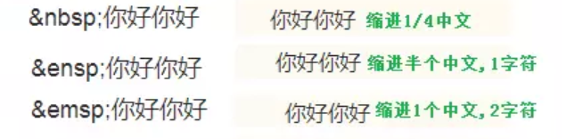

[toc]

# 注意事项

- **转义字符**




> 1、单个回车，视为空格　　
> 
> 2、连续回车，才能分段
> 
> 3、行尾加两个空格，就可以段内换行

* 看[特殊字符](https://unicode-table.com/cn/ "各种表情包和符号")(使用HTML代码)

比如: &#10003;（这个编译器显示不出来）

# 标题

&ensp;**太简单不讲**

# 字体效果

* \*字\*         是斜体：*正*
* \*\*字\*\*     是加粗：**细**
* \*\*\*字\*\*\* 是斜体和加粗：***正和细***
* \~\~字\~\~     是删除 ：~~存在~~
*    \=\=字 \=\=  是高亮:  ==人权宣言==

# 分割线

  

---

***

________

# 链接

## 网址链接

* **更直接如：**  <https://www.baidu.com>

* **直接设置（常用）：** 如：[百度](https://www.baidu.com "百度一下，你就知道")

* **间接设置：** 如：[百度][1]

  [1]: http://www.baidu.com "百度一下，你就知道"
  
* 以下为语法：
  
  ```
  <https://www.baidu.com>
  [百度](https://www.baidu.com "百度一下，你就知道(悬停文字)")
  [百度][1]
    [1]: http://www.baidu.com "百度一下，你就知道（悬停文字）"
  
## 本地内链接

* [点击看Git知识](Git的使用总结.md)

`[点击看Git知识](Git的使用总结.md)`

* [看论文](C:\Users\11431\Desktop\论文\一种紫外光敏电阻的制备与性能评价.docx)

`[看论文](C:\Users\11431\Desktop\论文\一种紫外光敏电阻的制备与性能评价.docx)`

`注意：括号内使用绝对地址或相对地址都可以的`

## 页内跳转

语法：`[链接文字](#标题文字[二级标题也可])`

* 请看：[这里到拓展用法上下标](#上下标 )

**要点注意：**

`()`内声明要跳转的目标标题，以`#`开头，标题内包含点、下划线**直接忽略**，有空格使用`-`代替，大写字母转换为小写字母。

# 图片

* **尽量使用相对路径，本文中使用的都是相对路径，自个看！！！！**

 * 本地图片链接：看下面

  ``

  


* 网络图片链接: 看下面，**右击复制图片地址即可**

``


# 代码块

* `我是单个代码句`

**注意先按三个点再回车即可输入**

* ```c
  下面是多行代码段
  int main()
  {
  printf("Hello markdown");
  return 0;
  }
  ```

# 引用块

  

> 天下大同
> 
> > 天下大同
> > 
> > > 天下大同 

谁与之？

# 列表


1. 你

2. 就

3. 好

# 表格


* | 学号  | 姓名  | 分数  |
  |:---:|:---:| --- |
  | 小明  | 男   | 75  |
  | 小红  | 女   | 79  |
  | 小陆  | 男   | 92  |

* | 项目       | 价格     | 数量  |
  |:-------- | ------:|:---:|
  | Computer | 1600 元 | 5   |
  | Phone    | 12 元   | 12  |
  | Pipe     | 1 元    | 234 |

# 绘制图表

> **本质是在代码块运行简单程序**

* 饼形图(Pie Chart)


* 流程图（Flow Chart）


* 时序图（Sequence Diagram）[点击可具体教学](https://blog.csdn.net/kl28978113/article/details/93617103?ops_request_misc=%257B%2522request%255Fid%2522%253A%2522165216529716782395379144%2522%252C%2522scm%2522%253A%252220140713.130102334..%2522%257D&request_id=165216529716782395379144&biz_id=0&utm_medium=distribute.pc_search_result.none-task-blog-2~all~top_positive~default-1-93617103-null-null.142^v9^control,157^v4^control&utm_term=markdown%E7%BB%98%E5%88%B6%E6%B5%81%E7%A8%8B%E5%9B%BE&spm=1018.2226.3001.4187 "CSDN")


* 状态图(State Diagram)

* 甘特图（Gantt Diagram）

* 类图(class Diagram)

...............

[Markdown里面使用mermaid画流程图](https://blog.csdn.net/Subson/article/details/78054689?ops_request_misc=%257B%2522request%255Fid%2522%253A%2522165203012816782390568426%2522%252C%2522scm%2522%253A%252220140713.130102334..%2522%257D&request_id=165203012816782390568426&biz_id=0&utm_medium=distribute.pc_search_result.none-task-blog-2~all~baidu_landing_v2~default-4-78054689-null-null.142^v9^control,157^v4^control&utm_term=markdown+mermaid&spm=1018.2226.3001.4187 "CSDN")

[点击获得更多类型](https://blog.csdn.net/weixin_38008864/article/details/106866122?%3E "CSDN")

# 拓展用法

## 快捷键

==大多数快捷键都可以看页面的显示==

[typora快捷键](https://blog.csdn.net/u011608357/article/details/108552962?ops_request_misc=%257B%2522request%255Fid%2522%253A%2522165203029416782248569636%2522%252C%2522scm%2522%253A%252220140713.130102334..%2522%257D&request_id=165203029416782248569636&biz_id=0&utm_medium=distribute.pc_search_result.none-task-blog-2~all~sobaiduend~default-1-108552962-null-null.142^v9^control,157^v4^control&utm_term=markdown%E5%BF%AB%E6%8D%B7%E9%94%AE&spm=1018.2226.3001.4187 "CSDN")

## 生成目录

`[toc]`

## 上下标

* 下标：`~2~`如：H~2~

* 下标：`^2^`如：x^2^
