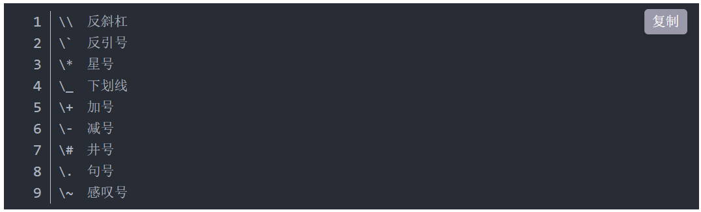

# 注意事项

- **转义字符**




> 1、单个回车，视为空格　　
> 
> 2、连续回车，才能分段
> 
> 3、行尾加两个空格，就可以段内换行

* 看[特殊字符](https://unicode-table.com/cn/ "各种表情包和符号")(使用HTML代码)

比如: &#10003;（这个编译器显示不出来）

# 标题

&ensp;**太简单不讲**

# 字体效果

* \*字\*         是斜体：*正*
* \*\*字\*\*     是加粗：**细**
* \*\*\*字\*\*\* 是斜体和加粗：***正和细***
* \~\~字\~\~     是删除 ：~~存在~~
*    \=\=字 \=\=  是高亮:  ==人权宣言==

# 分割线

  

---

***

________

# 链接

## 网址链接

* **更直接如：**  <https://www.baidu.com>

* **直接设置（常用）：** 如：[百度](https://www.baidu.com "百度一下，你就知道")

* **间接设置：** 如：[百度][1]

  [1]: http://www.baidu.com "百度一下，你就知道"
  
  ```
  更直接如： <https://www.baidu.com>
  直接设置（常用）:如：[百度](https://www.baidu.com "百度一下，你就知道(悬停文字)")
  间接设置：如：[百度][1]
    [1]: http://www.baidu.com "百度一下，你就知道（悬停文字）"
## 本地内链接

* [点击看Git知识](Git的使用总结.md)

`[点击看Git知识](Git的使用总结.md)`

# 图片

* **尽量使用相对路径，本文中使用的都是相对路径，自个看！！！！**

 * 本地图片链接：看下面

  ``

  


* 网络图片链接: 看下面，**右击复制图片地址即可**

``


# 代码块

* `我是单个代码句`

**注意先按三个点再回车即可输入**

* ```c
  下面是多行代码段
  int main()
  {
  printf("Hello markdown");
  return 0;
  }
  ```

# 引用块

  

> 天下大同
> 
> > 天下大同
> > 
> > > 天下大同 

谁与之？

# 列表


1. 你

2. 就

3. 好

# 表格


* | 学号  | 姓名  | 分数  |
  |:---:|:---:| --- |
  | 小明  | 男   | 75  |
  | 小红  | 女   | 79  |
  | 小陆  | 男   | 92  |

* | 项目       | 价格     | 数量  |
  |:-------- | ------:|:---:|
  | Computer | 1600 元 | 5   |
  | Phone    | 12 元   | 12  |
  | Pipe     | 1 元    | 234 |

# 绘制图表

1. 饼形图(Pie Chart)

mermaid
    pie 
    title Pets adopted by volunteers
    "Dogs" : 386
    "Cats" : 85
    "Rats" : 15 

2. 流程图（Flow Chart）

3. 时序图（Sequence Diagram）

4. 状态图(State Diagram)

5. 甘特图（Gantt Diagram）

6. 类图(class Diagram)
