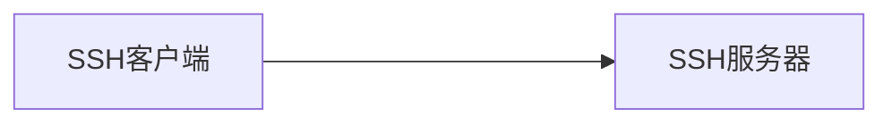
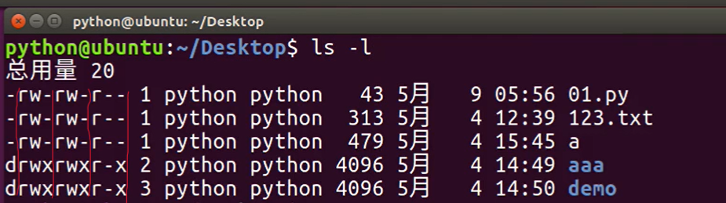

# Linux的常见命令

## 学习的必要性

* 在职场中，大量的**服务器维护工作**都是在**远程通过SSH客户端**来完成的，并没有图形界面，所有的维护工作都需要通过命令来完成
* 后端程序员必须要或多或少掌握一些常见的Linux命令

## 常见的命令

|       命令       |       对应英文       |                          作用                           |
| :--------------: | :------------------: | :-----------------------------------------------------: |
|       `ls`       |         list         |                  查看当前文件夹的内容                   |
|      `pwd`       | print work directory |                   查看当前所在文件夹                    |
|  `cd  <目录名>`  |   change directory   |                       切换文件夹                        |
| `touch <文件名>` |        touch         | 如果文件不存在，**新建文件**;否则修改文件的末次修改日期 |
| `mkdir <目录名>` |    make directory    |                        创建目录                         |
|  `rm <文件名>`   |        remove        |                   删除指定文件或目录                    |
|     `clear`      |        clear         |                          清屏                           |

> [`Ctrl+C`](#查看或配置网卡信息)是退出选择，取消执行当前选择的命令

### `ls`命令扩展

| 参数 | 含义                                         |
| ---- | -------------------------------------------- |
| -a   | 显示指定目录下所有子目录与文件，包含隐藏文件 |
| -l   | 以列表方式显示文件的详细信息                 |
| -h   | 配合-l以人性化的方式显示文件大小             |

> 配合使用：`ls -lh`
>
> [ls-l拓展](#`ls-l`拓展)

### `cd`命令扩展

| 命令      |                  含义                  |
| :-------- | :------------------------------------: |
| cd        | 切换到当前用户的主目录(/home/用户目录) |
| cd ~      | 切换到当前用户的主目录(/home/用户目录) |
| cd .      |           保持在当前目录不变           |
| ==cd ..== |             切换到上级目录             |
| ==cd -==  |    可以在最近2次工作目录间来回切换     |

### `mkdir`命令扩展

* 创建多个层层目录（想象套娃）：`mkdir -p a1/b1/c1/d1`

### `rm`命令扩展

| 参数 | 含义                                                         |
| ---- | ------------------------------------------------------------ |
| -f   | 强制删除，忽略不存在的文件，无需提示                         |
| -r   | 递归删除目录下的内容（即删除多级目录），删除**文件夹**时**必须**加此参数 |

### `tree`命令

以树状图列出文件目录结构

### `cp`命令

* 将文件或目录复制到另一个文件或目录中

### cat命令

* 查看文件内容、创建文件、文件合并、追加文件等
* 一次显示所有内容，适合显示**内容较少**的文件

### more命令

* 分屏显示文件内容，每次只显示一页内容，适合显示**内容较多**的文件

| 操作键 | 功能                 |
| ------ | -------------------- |
| 空格键 | 显示手册页的下一屏   |
| 回车键 | 一次滚动手册页的一行 |
| b      | 回滚一页             |
| f      | 前滚一页             |
| q      | 退出                 |
| /word  | 搜索`word`字符串     |

### `grep`命令

* `grep`命令是一个强大的文本搜索工具，使用语法：`grep (-n) <搜索的字符> <搜索的文件>`

| 选项 | 含义                       |
| ---- | -------------------------- |
| -n   | 显示匹配行及行号           |
| -v   | 显示不包含匹配文本的所有行 |
| -i   | 忽略大小写                 |

**两种常见的模式：**

|               |                            |
| ------------- | -------------------------- |
| ^<搜索的字符> | 搜索以<搜索的字符>开头的行 |
| <搜索的字符>$ | 搜索以<搜索的字符>结束的行 |

> 如果搜索字符含空格，需用`""`，如`grep -i "Hello World" a.txt`

### 其他命令

#### echo命令和重定向`>`,`>>` 

* echo一般和重定向配合使用，如果单独使用的话，如：`echo Hello World`就是在终端上显示`Hello World`
* `>`表示输出，会覆盖原有的内容；`>>`表示追加，会将内容追加到已有文件的末尾

示例：命令`echo Hello World >> a`，表示将`Hello World`追加到文件`a`的末尾

#### 管道`|`

* 使用语法：`命令1 | 命令2`

* 将一个命令通过管道`|`输出，作为另一个命令的输入，如：`ls | cat`将显示的目录作为`cat`命令的输入。

* 管道常常涉及命令：`more`、`grep`

# 远程管理的常用命令

## `shutdown`命令

* 作用：重新启动系统/安全关闭系统
* 语法：`shutdown <参数> <时间>`

>* 参数`-r`代表重新启动，`-c`代表取消启动计划，不指定参数和时间表示1分钟之后关闭系统
>* 时间可以是`20:18`，也可以是`+10`表示10分钟后执行，`now`表示现在执行
>
>* 远程运行维护服务器的时候，应该重新启动系统

## 查看或配置网卡信息

| 命令          | 对应英文                      | 作用                              |
| ------------- | ----------------------------- | --------------------------------- |
| ifconfig      | configure a network interface | 查看/配置计算机当前的网卡配置信息 |
| ping <ip地址> | ping                          | 检测到目标IP地址的连接是否正常    |

* [管道组合命令](#管道|):`ifconfig | grep inet`查看网卡对应的**IP地址**
* `ping`一般用于检测当前计算机到目标计算机之间的网络**是否通畅，数值越大，速度越慢**

> * `ping`的原理：给目标`IP`地址发送一个数据包，对方就要返回一个数据包，根据返回的数据包以及时间，我们可以确定目标主机的存在
> * 绝大多数可通过[`Ctrc+C`](#常见的命令)终止程序执行

## 远程登录和复制文件

### ssh基础

在Linux中，我们可以通过**SSH客户端**连接到运行了**SSH服务器**的远程机器上


* 数据通过**加密**并且**压缩**传输，这样可以防止信息泄露，加快传输速率
* SSH是目前比较可靠，**专为远程登录会话和其他网络服务**提供安全性的协议
  * 利用SSH协议可以有效防止远程管理过程中的信息泄露
  * 通过SSH协议可以对所有传输的数据进行加密，也能防止DNS欺骗和IP欺骗


> * IP地址：通过IP地址找到网络上的计算机
> * 域名：如`www.baidu.com`IP地址的别名
> * 端口号：通过端口号可以找到计算机上运行的应用程序

* SSH服务器的默认端口号是22，使用默认端口号，连接时可以省略

* 常见端口号

| 服务      | 端口号 |
| --------- | ------ |
| SSH服务器 | 22     |
| Web服务器 | 80     |
| HTTPS     | 443    |
| FTP服务器 | 21     |

### 远程登录

语法：`ssh (-p port) user@remote`

* `user`为远端用户名，不指定默认为当前用户
* `remote`是远端机器地址，可以是**[IP/域名等](#查看或配置网卡信息)**(==点击链接了解查看远端IP方式==)
* `port`是SSH Server 监听的端口号，如果不指定默认为22

> * 使用`exit`退出当前用户的登录
> * 在`Windows`系统中，需要安装`puTTY`或`XShell`才能使用

### 复制文件（`scp`命令）

* 适用于本地端和远端的文件互传

* 语法格式与`ssh`基本一致，但是指定端口使用大写字母`-P`

* **示例：**

  * 把本地当前目录下的`01.py`文件复制到远程`home`目录下的`Desktop/01.py`:

    `scp -P <端口号> 01.py user@remote:Desktop/01.py`

  * 把远程`home`目录下的`Desktop/01.py`文件复制到本地当前目录下的`01.py`:

    `scp -P <端口号> user@remote:Desktop/01.py 01.py `

  ---

  [==有关-r==](#`rm`命令扩展)

  * 把当前目录下的`demo`文件夹复制到远程`home`目录下的`Desktop`：

    `scp -r demo user@remote:Desktop`

  * 把远程`home`目录下的`Desktop`复制到的当前目录下`demo`文件夹：

  * `scp -r user@remote:Desktop demo`


## ssh高级

### [免密登录](https://blog.csdn.net/jeikerxiao/article/details/84105529?ops_request_misc=%257B%2522request%255Fid%2522%253A%2522165219950516781435430794%2522%252C%2522scm%2522%253A%252220140713.130102334..%2522%257D&request_id=165219950516781435430794&biz_id=0&utm_medium=distribute.pc_search_result.none-task-blog-2~all~top_positive~default-1-84105529-null-null.142^v9^control,157^v4^control&utm_term=SSH%E5%85%8D%E5%AF%86%E7%99%BB%E5%BD%95&spm=1018.2226.3001.4187)

### [配置别名](https://blog.csdn.net/wjlwangluo/article/details/111144786?ops_request_misc=%257B%2522request%255Fid%2522%253A%2522165219978416781435479071%2522%252C%2522scm%2522%253A%252220140713.130102334.pc%255Fall.%2522%257D&request_id=165219978416781435479071&biz_id=0&utm_medium=distribute.pc_search_result.none-task-blog-2~all~first_rank_ecpm_v1~rank_v31_ecpm-2-111144786-null-null.142^v9^control,157^v4^control&utm_term=SSH%E7%99%BB%E5%BD%95%E8%AE%BE%E7%BD%AE%E5%88%AB%E5%90%8D&spm=1018.2226.3001.4187)

### [ssh免密登录 + ssh别名设置](https://blog.csdn.net/cynthrial/article/details/82319498?ops_request_misc=%257B%2522request%255Fid%2522%253A%2522165219978416781435494102%2522%252C%2522scm%2522%253A%252220140713.130102334..%2522%257D&request_id=165219978416781435494102&biz_id=0&utm_medium=distribute.pc_search_result.none-task-blog-2~all~sobaiduend~default-1-82319498-null-null.142^v9^control,157^v4^control&utm_term=SSH%E7%99%BB%E5%BD%95%E8%AE%BE%E7%BD%AE%E5%88%AB%E5%90%8D&spm=1018.2226.3001.4187)

# 用户权限相关命令

## 权限

| 权限 | 英文   | 缩写 | 数字代号 |
| ---- | ------ | ---- | -------- |
| 读   | read   | r    | 4        |
| 写   | write  | w    | 2        |
| 执行 | excute | x    | 1        |

> * 给权限的单位可以是单个个体，也可以是组（包含多个个体）
> * **目录**拥有可执行权限才能被用户操作（进入、展示内容等）

## `ls-l`拓展

* [ls命令信息](#`ls`命令扩展)
* 使用`ls-l`后，出现信息从左到右依次是：

|            权限             |             硬连接数             |     拥有者     |             组             | 大小 | 时间 | 名称 |
| :-------------------------: | :------------------------------: | :------------: | :------------------------: | :--: | :--: | :--: |
| 第一个字符如果是`d`表示目录 | 有多少种方式访问到当前目录或文件 | 通常是当前用户 | 很多情况，组名和用户名相同 |  \   |  \   |  \   |

> 第一组别权限对应文件目录的拥有者；第二组组别权限对应组的权限；第三组别权限为拥有者和组之外的权限

**例如：**



## `chmod`的简单使用（重要内容）

* `chmod`可以修改**用户/组**对**文件/目录**的权限
* 语法：`chmod -/+ rwx <文件或目录>` 
* 点击[修改文件权限](#修改文件权限)了解更多用法

> 提示：以上方式会一次性修改(增加或减少)`拥有者/组`权限

## 超级用户

​		超级用户(`root`账号)，Linux系统中权限最高的用户。当要使用超级用户的权限时，一般不直接使用root账号登录系统，而是使用`sudo`命令让当前的用户拥有超级用户的权限。

### sudo

* 即`substitute user`，表示使用另一个用户（预设为`root`）的身份
* 使用`sudo`命令时，必须要输入密码，之后又`5min`的有效时间，超过时间要重新输入

## 组管理 终端命令

| 命令                            | 作用                      |
| ------------------------------- | ------------------------- |
| `group add <组名>`              | 添加组                    |
| `group del <组名>`              | 删除组                    |
| `cat/ect/group`                 | 确认组信息                |
| `chgrp -R <组名> <文件/目录名>` | 递归修改文件/目录的所属组 |

> * **添加/删除组**的终端命令都需要通过`sudo`命令执行
>
> * 组信息保存在`/ect/group`文件中，其中/etc是专门用来保存`系统配置信息`的目录
> * [点击](https://blog.csdn.net/weixin_42558758/article/details/116741802?ops_request_misc=%257B%2522request%255Fid%2522%253A%2522165227217416781432927624%2522%252C%2522scm%2522%253A%252220140713.130102334.pc%255Fall.%2522%257D&request_id=165227217416781432927624&biz_id=0&utm_medium=distribute.pc_search_result.none-task-blog-2~all~first_rank_ecpm_v1~rank_v31_ecpm-2-116741802-null-null.142^v9^control,157^v4^control&utm_term=Linux+%E6%B7%BB%E5%8A%A0%E7%BB%84%E6%88%90%E5%91%98&spm=1018.2226.3001.4187)即可了解如何添加组成员

## 用户管理 终端命令

### 创建用户/设置密码/删除用户

| 命令                              | 作用         | 说明                                                         |
| --------------------------------- | ------------ | ------------------------------------------------------------ |
| `useradd -m -g <组> <新建用户名>` | 添加新用户   | -m自动建立用户`home`目录；-g指定用户所在组，否则会建立一个和用户名名字同样的组 |
| `passwd <用户名>`                 | 设置用户密码 | 如果是普通用户，直接可以用`passwd`修改密码                   |
| `userdel -r <用户名>`             | 删除用户     | -r 选项会自动删除用户home目录                                |
| `cat/ect/passwd\`                 | 搜索用户名   | 确认用户信息（新建用户后，用户信息会保存在`/ect/passwd`文件中） |

> 创建用户/设置其他用户密码/删除用户的终端命令都需要通过`sudo`来执行

### 查看用户信息

| 命令        | 作用                                     |
| ----------- | ---------------------------------------- |
| id <用户名> | 查看用户的UID（用户代号）和GID（组代号） |
| who         | 查看当前所有登录的用户列表               |
| whoami      | 查看当前登录用户的账户名                 |

> * `passwd`文件存放用户的信息，具体位置`/etc/passwd`，由6个分号组成7个信息为：`用户名`、`密码`、`UID`、`GID`、`用户全名或本地账号`、`家目录`、`登录使用的shell`等
> * `/usr/bin/passwd`是用于修改用户密码的程序

#### `usermod`命令

* 可以设置用户登录使用的`shell`
* 具体用法可以搜索`CSDN`了解

#### `which`命令（重要）

* `which`命令可以查看执行命令所在的位置，如：

```
which ls

# 输出
# /bin/ls
```

### 切换用户账户

| 命令      | 作用                   |
| --------- | ---------------------- |
| su-用户名 | 切换用户，并且切换目录 |
| exit      | 退出当前登录用户       |

>* su不接用户名，可以切换到root，不推荐

## 修改文件权限

| 命令                                      | 语法                               | 作用                      |
| ----------------------------------------- | ---------------------------------- | ------------------------- |
| `chown`                                   | `chown <新拥有者> <文件名/目录名>` | 修改[拥有者](#`ls-l`拓展) |
| `chgrp`                                   | `charp -R <新组> <文件名/目录名>`  | 修改组                    |
| [`chmod`](#`chmod`的简单使用（重要内容）) | `chmod -R 755 <文件名/目录名>`     | 修改权限                  |

> * -R作用是递归修改，就是囊括所有
> * `chmod`在设置权限时可以使用三个数字分别**对应拥有者/组/其他用户**权限
> * 各权限的表示数字如下表所示，000表示没有权限
>
> | r    | w    | x    |
> | ---- | ---- | ---- |
> | 4    | 2    | 1    |

# 系统信息相关命令

## 时间

| 命令 | 作用                                         |
| ---- | -------------------------------------------- |
| date | 查看系统时间                                 |
| cal  | calendar 查看日历，-y 选项可以查看一年的日历 |

## 磁盘信息

| 命令   | 作用                              |
| ------ | --------------------------------- |
| `df-h` | [disk free ]显示磁盘剩余信息      |
| `du-h` | [disk usage] 显示目录下的文件大小 |

> -h表示以人性化的方式显示文件大小

## 进程信息

| 命令                    | 作用                         |
| ----------------------- | ---------------------------- |
| `ps aux`                | [process status]查看进程状态 |
| `top`                   | 动态显示运行中的进程并排序   |
| `kill （-9）<进程代号>` | 终止进程，-9表示强行终止     |

> 要退出top，可以输入q

## 查找文件

### find

## 软链接

## 打包压缩

## 终端窗口

* 终端窗口的放大：`Ctrl shift =`
* 终端窗口的缩小：`Ctrl -`

## 命令

* 自动补全：在敲出`文件或目录或命令`的前几个字母后，按下`Tab`
  * 没有歧义，自动补全
  * 有歧义，再按`Tab	`，系统会提示存在的命令

* 执行文件语法：`./<文件>`
